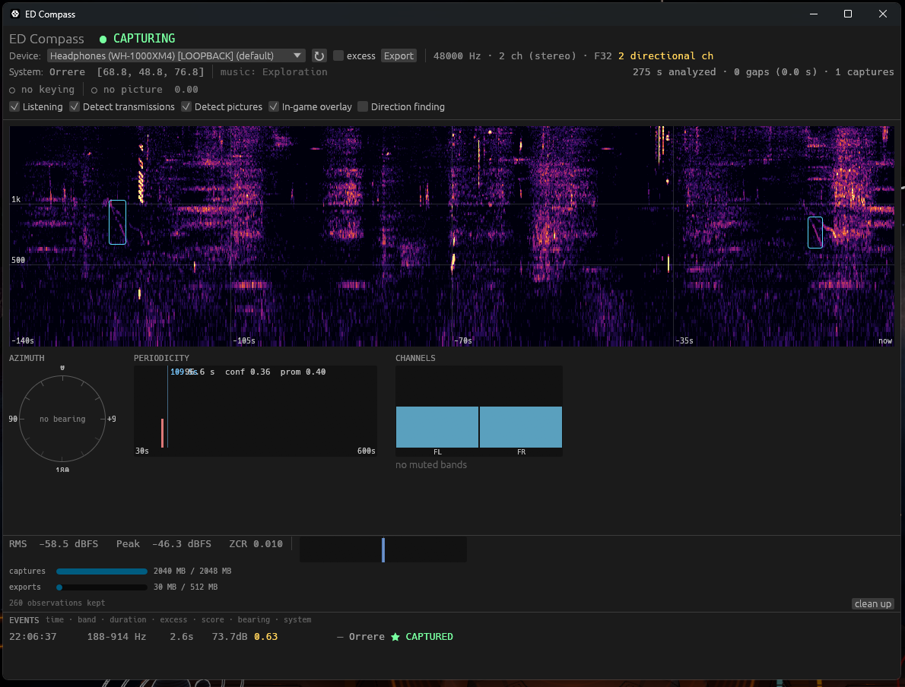

# ED Compass

> [!CAUTION]
> ## ⚠️ PRE-RELEASE — WORK IN PROGRESS
>
> **THIS IS NOT READY FOR PUBLIC DISTRIBUTION. PLEASE DO NOT SHARE OR
> REDISTRIBUTE IT YET.**
>
> This repository is published for development and testing only. Detector
> thresholds, file formats and the interface are all still changing, results are
> not yet dependable, and there are no published releases to install. Anything it
> reports should be treated as provisional.

**Elite Dangerous hides signals in its audio. This listens for them while you fly.**

There is something in the black that transmits. The
[Landscape Signal](https://canonn.science/codex/cartographics/the-landscape-signal/)
is a picture drawn in sound — mountains, a horizon, a repeating pattern — audible
from anywhere in the galaxy, discovered by commanders who happened to look at a
spectrogram. Nobody knows how many others there are.

ED Compass watches for them so you don't have to. Three lamps in your cockpit,
lit when something is out there.

The full view — everything the tool heard in the last few minutes. While
flying you'd normally use the cockpit overlay instead.

<!-- More screenshots -->

---

## Install

> [!NOTE]
> **There is no release to download yet.** The section below describes how
> installing *will* work once the first build is published. Until then the only
> way to run it is to [build from source](docs/reference.md#building-from-source).

**[⬇ Download the latest release](../../releases/latest)** — run
`ED-Compass-Setup.exe` and you're done. No administrator rights, nothing else to
install.

Windows will say *"unknown publisher"*. Click **More info → Run anyway**. That
warning appears for every small free tool that hasn't paid for a signing
certificate.

Then start Elite. The overlay appears by itself whenever the game is in front of
you, and gets out of the way when it isn't.

> **Elite must run in borderless mode**, not exclusive fullscreen — no overlay of
> any kind can draw over exclusive fullscreen.

## What you'll see

Three indicators, in the order you should trust them:

| | |
|---|---|
| **SIGNAL** | A repeating transmission, identified by its measured period. A recognised one is named — the Landscape Signal's 109.5 s cycle is checked against a known recording, so a match means what it says. |
| **TRANSMIT** | Something is keying tones on and off, the way a transmission does. |
| **STRUCTURE** | The spectrogram has thin diagonal strokes in it — something *drawn* rather than noise. |

Beside them, a live spectrogram of what the game is playing. When something
fires, the audio is saved automatically, tagged with the star system and
coordinates you were at.

**TRANSMIT and STRUCTURE also light on ordinary ship ambience.** They are hints,
not verdicts. SIGNAL is the one that has been checked.

## Is this allowed?

Yes. It listens to sound your speakers are already playing and reads the journal
files the game writes for exactly this purpose — the same things EDDiscovery,
EDMC and every other companion tool use. It never touches the game process, its
memory, or its files, and it gives you no advantage over any other commander. It
only notices things you could have noticed yourself with headphones and patience.

## Does it actually work?

Yes, and you don't have to take our word for it. Given CMDR Serbanstein's
published recording of the real Landscape Signal — one exact cycle, 109.63
seconds — ED Compass measures **109.67 seconds at 0.98 confidence**, with no
template and nothing to match against. It found the period from the audio alone.

It costs about **a quarter of one percent of a CPU core** and 42 MB of memory, so
you can leave it running.

## Finding something

If you catch a signal nobody has catalogued, that's a find worth sharing.

1. Note the system and where you were pointing.
2. Export the spectrogram (**Export PNG** in the full view).
3. Take it to the [Canonn Research Group](https://canonn.science/) — they are the
   people who found the Landscape Signal in the first place.

Every detection keeps a small JSON record with the system, coordinates, scores
and period — kept forever, even after the audio itself is cleaned up, so your
observations accumulate into something you can triangulate from.

## Questions

**Will it fill my disk?** No. Recordings are FLAC and capped (about 2 GB by
default, roughly 350 captures). When it's full the *weakest* detections are
cleaned up first, never the best ones, and the written record of every
observation is kept regardless. There's a usage bar and a **clean up** button in
the control panel.

**Do I need 7.1 surround?** No. Direction finding is an optional extra that needs
it; detection works fine in stereo, which is what almost everyone should use.

**Does it make any sound?** No, deliberately — an audio alert would be picked up
by its own microphone-equivalent and detected as a signal.

**Can I just unzip it?** Yes, there's a portable zip on the releases page.
Settings and recordings stay in that folder.

## More

- **[Technical reference](docs/reference.md)** — how it works, how it was
  validated, every setting, and what it deliberately does not do.
- **[The Landscape Signal](https://canonn.science/codex/cartographics/the-landscape-signal/)** —
  Canonn's write-up of the thing this was built to find.
- Bugs and ideas: [open an issue](../../issues).

## Credits

The research is the [Canonn Research Group](https://canonn.science/)'s. The
Landscape Signal was found by CMDR PublicStaticVoid in 2019 and triangulated by
CMDR Seventh_Circle; the reference recording that this tool was validated
against is CMDR Serbanstein's. None of their material is redistributed here.

MIT licensed — see [LICENSE](LICENSE). Elite Dangerous is a trademark of Frontier
Developments plc; this is an unofficial tool, not affiliated with or endorsed by
Frontier.

o7

[![Licence][badge-licence]](./LICENSE)
[![Rust][badge-rust]](https://www.rust-lang.org/)
[![Elite Dangerous][badge-ed]](https://www.elitedangerous.com/)

[badge-licence]: https://img.shields.io/github/license/tbma2014us/ed-compass?style=for-the-badge
[badge-rust]: https://img.shields.io/badge/Rust-%23000000.svg?style=for-the-badge&logo=rust&logoColor=white
[badge-ed]: https://img.shields.io/badge/ELITE%20DANGEROUS-unofficial%20tool-F07B05?style=for-the-badge&logo=data:image/svg%2Bxml;base64,PHN2ZyB4bWxucz0iaHR0cDovL3d3dy53My5vcmcvMjAwMC9zdmciIHZpZXdCb3g9IjAgMCAyMDAwIDIwMDAiPjxnPjxwb2x5Z29uIGZpbGw9IiNGMDdCMDUiIHBvaW50cz0iOTk5Ljc3NCwxMDUzLjY4NSAxMDY1LjUwNiw5OTUuOTU0IDExODEuNzgxLDk5NS45NTQgMTE1MS4wODQsOTY5LjQxNyAxMDczLjI4MSw5NTUuOTQ1IDEwNzEuMzgzLDkyOC4xNDIgMTEyNS40NTEsOTI4LjE0MiAxMDk0LjQ0LDkwMi4yMzggMTA1OC4yNzMsODk2LjA5IDEwNDkuMjMxLDg0MC4zMDMgMTA2NC42MDIsODI3LjA1NyAxMDQzLjUzNSw1NzEuOTk0IDEwMzMuMDAxLDYyOS41NDMgMTAyNy4yNiw3NzQuNTI1IDk5OS42ODQsNzk1LjIzIDk3Mi40NjgsNzc0LjUyNSA5NjYuNzI3LDYyOS41NDMgOTU2LjE5NCw1NzEuOTk0IDkzNS4xMjYsODI3LjA1NyA5NTAuNDUxLDg0MC4zMDMgOTQxLjQxLDg5Ni45OTQgOTA1LjI4OSw5MDIuMjM4IDg3NC4yNzcsOTI4LjE0MiA5MjguMyw5MjguMTQyIDkyNi40MDIsOTU1Ljk0NSA4NDguNTk4LDk2OS40MTcgODE3LjkwMyw5OTUuOTU0IDkzNC4yMjIsOTk1Ljk1NCAiLz48cGF0aCBmaWxsPSIjRjA3QjA1IiBkPSJNMTE4OC4xNTYsODIwLjU0N2gtMC40NTJ2MzIuNzc2YzAsMCw2MS4zOTMsNDguMzI3LDYxLjM5MywxMDYuMzc0bC02Ny4yMjUsNjcuODEyaC02OC45ODdsLTUxLjY3Myw1MC40NTIgdjAuMzYybDAsMGwtMy41MjYsMTcuMTc5SDk0Mi41ODZsLTMuNTI2LTE3LjEzNGwwLDB2LTAuMzYxbC01MS42NzMtNTAuMzE3aC02OS4wMzNsLTY3LjIyNC02Ny44MTIgYzAtNTcuODY2LDYxLjQzOC0xMDYuMTAzLDYxLjQzOC0xMDYuMTAzdi0zMy40MDloLTAuNDUyTDAsODYuMzI1QzAuNDUyLDI2MS40NiwwLjQ1MiwyOTEuNzA0LDc1LjMxNywzNjEuNjg3IGMxLjY3MywxLjQ5Miw2Ni45MDcsNjMuMjkxLDc2LjIyMSw3MC42MTR2MS4yNjZjMCwxNjIuMDI1LDAsMTYyLjAyNSw2My4yOTEsMjE2Ljk5OWMxLjk4OSwxLjc2Myw3My43MzQsNjguOTQxLDczLjczNCw2OC45NDEgcy0wLjI3MSwyMi45MjEsMCwzMC4yNDRjMCwxMTYuNDExLDAsMTE3Ljc2OCw1My4zLDE3NS40MDdjMTkuODkyLDIxLjUyLDEwMi43MTIsOTkuNDU4LDE4My45NTEsMTc0LjU5M0gyNjguMTczbDI4OC41MTgsMjU3LjY4NiBoMzE1LjgyM2wtMjguMjEsNDkuNzI5SDYwOC44NjFsNzguOTc5LDY3LjgxM2gyMDUuMjg5bDEwNi45NjItMjEwLjI2M2wxMDkuMjIzLDIxMC4yNjNoMjAyLjI2bDc4Ljk3OS02Ny44MTNoLTIzMi41MDQgbC0yOC4yMS00OS43MjloMzE2LjgxN2wyODUuNDg4LTI1Ny42ODZoLTI1Ny42ODZjODEuMzc1LTc1LjMxNiwxNjMuOTY5LTE1My4wNzQsMTgzLjkwNi0xNzQuNTQ4IGM1My4zOTEtNTcuNjQsNTMuMjU1LTU4Ljc3MSw1My4yNTUtMTc1LjM2MWMwLTcuMzY5LDAtMzAuMjg5LDAtMzAuMjg5czcxLjc0NS02Ny4xMzQsNzMuNzMzLTY4Ljg5NyBjNjMuMjkyLTU1LjE1Myw2My4yOTItNTUuMTUzLDYzLjI5Mi0yMTYuOTk4di0xLjI2NmM5LjQwMy03LjAwNyw3NC4zNjYtNjkuMDc4LDc2LjA0LTcwLjU3IGM3NC44NjMtNjkuOTM3LDc0Ljg2My0xMDAuMjI2LDc1LjMxNi0yNzUuNDk3TDExODguMTU2LDgyMC41NDd6Ii8%2BPHBhdGggZD0iTTEwMDEuNDQ3LDE5MTMuNjc2TDEwMDEuNDQ3LDE5MTMuNjc2TDEwMDEuNDQ3LDE5MTMuNjc2eiIvPjxwYXRoIGZpbGw9IiNGMDdCMDUiIGQ9Ik0xMDAxLjk0NCwxNDAyLjczNWwtMTAyLjAzNCwyNDMuMjY0bDcwLjE2Myw2OC4xMjljLTkuMzEzLDU4LjU0NC0xOC4wODQsMTE3LjEzNC0xOC41MzUsMTI5LjQ3NiBjLTAuNjM0LDI1LjQ5Nyw0Ny40MjMsNjcuODEyLDQ5LjcyOSw3MC4wNzJjMi4zOTYtMi4wOCw1MC40MDYtNDQuNTc1LDQ5LjcyOS03MC4wNzJjLTAuMzE2LTExLjk4LTguNzI1LTY3LjgxMy0xNy43NjctMTI0LjYzOSBsNzAuMTYzLTcyLjk2NkwxMDAxLjk0NCwxNDAyLjczNXoiLz48L2c%2BPC9zdmc%2B